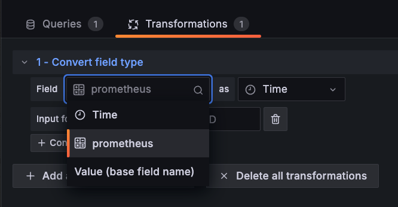
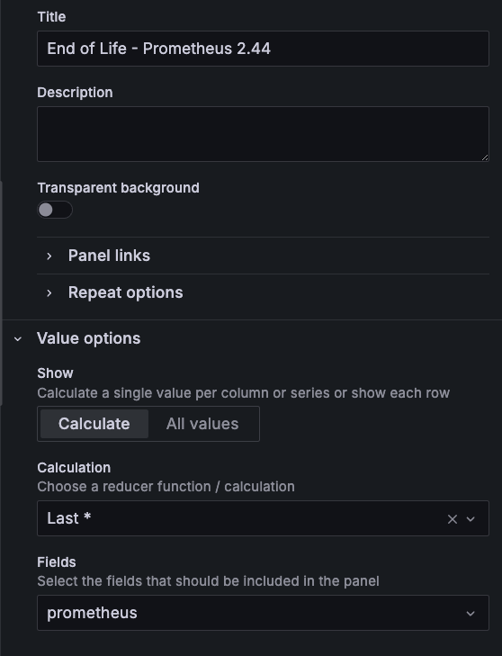

# Considerations

In order to make the dashboard work, each new panel needs to have some fields updated.

Import the file `dashboard.json` to your Grafana instance and make any necessary changes in the datasource to start using it.

> :warning: **This dashboard currently don't send Alerts when the End of Life of a service is approaching due the fact that the Stats panel don't support Alerts**

## Query

In the `Queries` section, update the service name and the version you want to monitor in the label `cycle`:

```
endoflife_service{service="prometheus", cycle="2.44"} * 1000
```

Keep the multiplication operator `* 1000` to proper show "End of Life" date for the service you are monitoring.

## Transformations

Each panel uses a `Transformations` called `Convert field type` to convert timestamp date format, that comes from prometheus, into a human readable date format.

This conversion uses the service name from the prometheus query label, so update it in the `Transformations` tab, like below.



## Panel Settings

Service name also should be updated in the `Title` field, and finally in `Value options >> Fileds`



This update should put everything to work. 